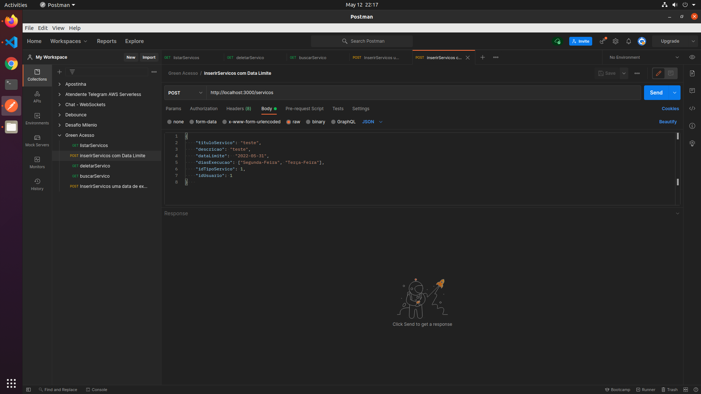
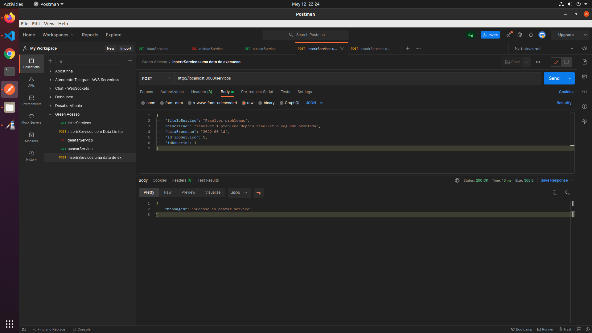
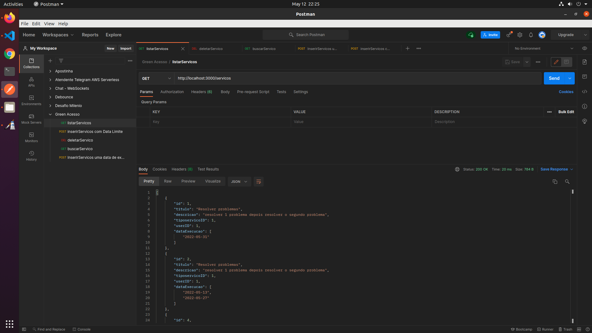
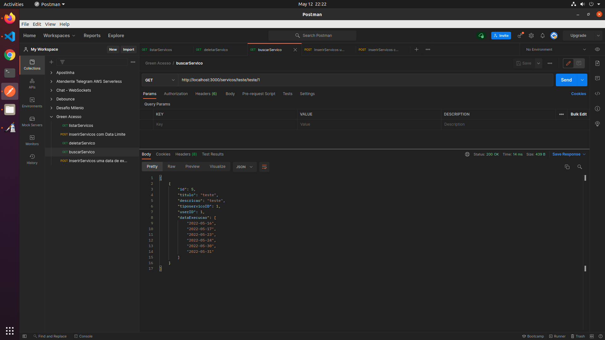
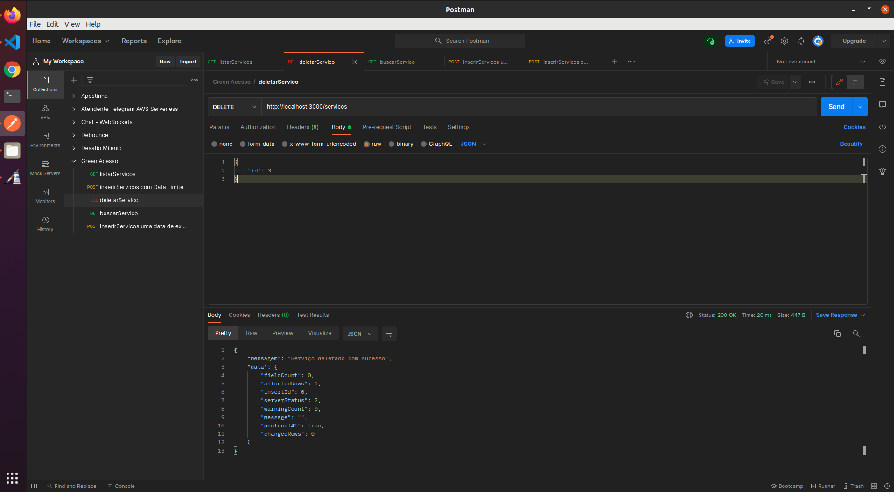

<h1>Como rodar projeto e testar </h1>

1. Precisa ter o mysql e preencher com os dados de acesso em: src/database/connection.js (Criação de database e tabelas é automatico, como usuario e tipos de serviços) 
2. clonar repo
3. cd repo
4. npm install
5. npm start

Para testar com o POSTMAN utilizar a collection.json e importar no seu POSTMAN

<h2>POST - /servicos</h2>
 
 
<h3>1. Com Data Limite Agendando Dias da Semana<h3>
 

 
 
<h3>2. Uma data de execucao<h3>
 

 
 
<h2>GET - /servicos</h2>
 
 
<h3>1. Listar todos Serviços <h3>
 

 
 
<h3>2. Listar com filtros<h3>
 

 
 
<h2>DELETE - /servicos</h2>
 
 
<h3>1. Deletar um serviço <h3>
 

